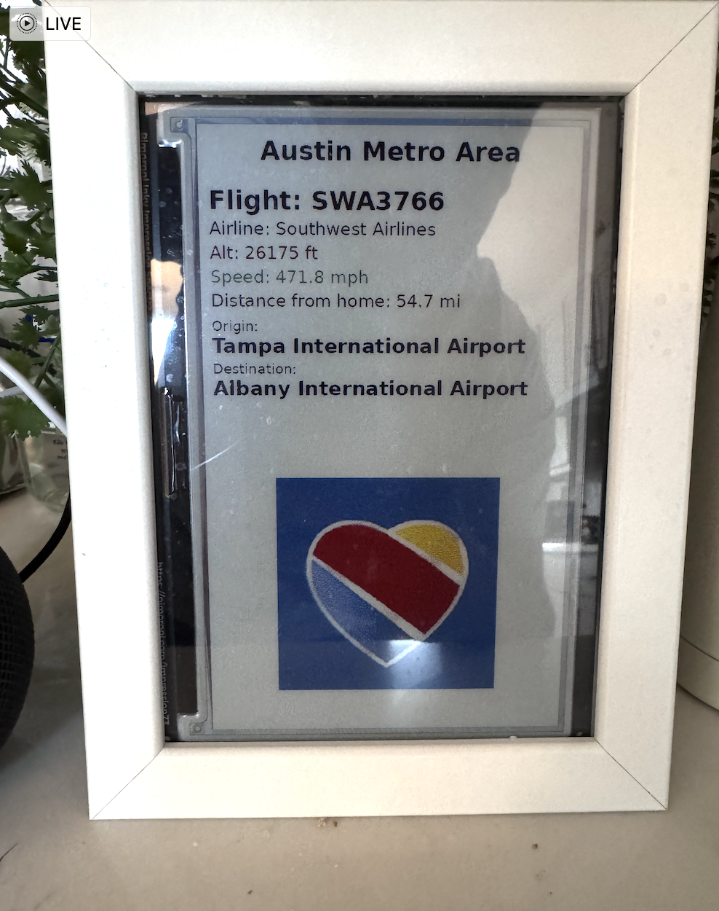

# Flight Tracker Display on Inky Impression 7.3"



A Python-based project that displays real-time aircraft data on an [Inky Impression 7.3"](https://shop.pimoroni.com/products/inky-impression-7-3) e-ink display using a Raspberry Pi. It fetches aircraft positions, airline logos, and route information via public APIs.

---

## ✈️ What It Does

- Fetches aircraft near specified cities (Austin, Dallas/Fort Worth, Houston)
- Displays:
  - Flight callsign and airline
  - Altitude and ground speed
  - Distance from home location (Georgetown, TX)
  - Origin and destination airports
  - Airline logo (when available)
- Rotates between cities every 5 minutes
- Updates aircraft info every 10 seconds

---

## 🧱 Hardware Requirements

| Item                            | Buy Link                                                                 |
|---------------------------------|--------------------------------------------------------------------------|
| Raspberry Pi (any recent model) | [Raspberry Pi 4](https://www.raspberrypi.com/products/raspberry-pi-4-model-b/) |
| Inky Impression 7.3" display    | [Pimoroni](https://shop.pimoroni.com/products/inky-impression-7-3)     |
| Micro SD Card (16GB+)           | Any reliable brand                                                       |
| Power Supply                    | Official Raspberry Pi USB-C or micro-USB                                 |
| WiFi or Ethernet Connectivity   | Required                                                                 |

---

## 🌐 APIs Used

### 1. [ADS-B.lol API](https://api.adsb.lol/docs)

- Real-time aircraft position data sourced from community-operated ADS-B receivers.
- Used to fetch aircraft within a defined radius of a geographic location.

**Example Endpoint:**
```
GET https://api.adsb.lol/v2/point/{lat}/{lon}/{radius}
```

📄 Documentation: [https://api.adsb.lol/docs](https://api.adsb.lol/docs)

---

### 2. [ADSBdb API](https://www.adsbdb.com/)

- Provides route, airline, and airport metadata based on aircraft callsign.
- Used to fetch airline name, origin, and destination for improved display info.

**Example Endpoint:**
```
GET https://api.adsbdb.com/v0/callsign/{CALLSIGN}
```

📄 Documentation: [https://www.adsbdb.com/](https://www.adsbdb.com/)

---

## 🔧 Installation

1. **Clone this repository**:
   ```bash
   git clone https://github.com/yourusername/flight_tracker_display.git
   cd flight_tracker_display
   ```

2. **Install dependencies**:
   ```bash
   pip install -r requirements.txt
   ```

3. **Enable SPI and I2C on your Raspberry Pi**:
   ```bash
   sudo raspi-config
   # Navigate to "Interfaces" and enable SPI and I2C
   ```

4. **Run the script**:
   ```bash
   python3 flight_tracker.py
   ```

---

## 📁 Project Structure

```
flight_tracker_display/
├── flight_tracker.py      # Main Python script
├── example.png            # Example display screenshot
├── requirements.txt       # Python dependencies
├── .gitignore             # Ignore files for Git
└── README.md              # You're reading this!
```

---

## 📝 License

This project is licensed under the MIT License. Attribution to ADS-B.lol and ADSBdb is required when redistributing or publishing derivatives.

---

## 🙏 Acknowledgements

- [ADS-B.lol](https://adsb.lol) — Real-time community aircraft tracking
- [ADSBdb](https://www.adsbdb.com) — Free global flight database

If you made it this far and still don’t have this running on your Inky Impression, well… maybe the clouds aren’t cooperating, or you just love staring at a blank screen instead of watching real-time flights. Come on, avgeeks—let’s get tracking!
